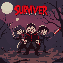
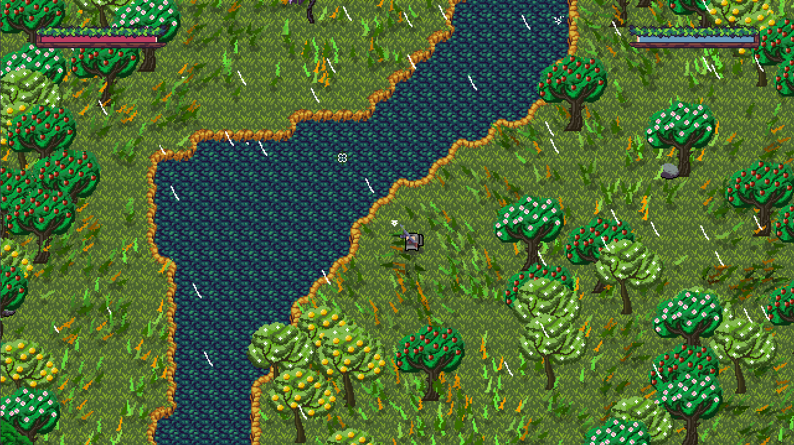

# Survivor Coursework Project



## 🎮 About The Game

Survivor is a thrilling 2D top-down game built with Python, leveraging the power of pygame and OpenGL. Immerse yourself in a world where survival is key, and every decision counts!

## 🚀 Features

- Engaging 2D top-down gameplay
- Dynamic enemy AI
- Multiple weapons with unique characteristics
- Perlin noise-generated environments
- Advanced particle systems for visual effects
- Customizable game settings

## 🖼 Screenshots



## 📦 Dependencies

To run this game, you'll need the following Python packages listed in the requirements.txt

You can install the required packages using pip:

```bash
pip install -r requirements.txt
```

### Installation

1. Clone the repository
```bash
git clone https://github.com/digotill/Survivor-Coursework-Project.git survivor-coursework-project
```
2. Navigate to the project directory
```bash
cd survivor-coursework-project
```
3. Create a virtual environment
```bash
python -m venv venv
```
4. Install the required packages
```bash
venv/pip install -r requirements.txt
```
5. Run
```bash
venv/python run.py
```

### Running the Game

Simply run the provided "run.exe" file to start the game.

## 🎛 Controls

- WASD: Move the player
- Mouse: Aim
- Left Click: Shoot
- Shift: Sprint
- ESC: Pause game

## 🐛 Known Issues

1. Memory Leak: The game may experience gradual memory usage increase over extended play sessions.

2. Performance Dips: Users might experience temporary drops in frame rate during certain high-intensity actions or in areas with many entities.

3. Tile Orientation: In rare cases, some tiles may not be properly oriented. This is a visual glitch and doesn't affect gameplay.

### Packaging the Game

To create an executable, use pyinstaller:

```bash
pyinstaller run.py --onefile --windowed --noconsole --add-data "Assets;Assets"
```

## 👨‍💻 Authors

 -[Digotill](https://github.com/digotill)

## 📄 License

This project is licensed under the [MIT license] - see the [LICENSE](LICENSE.md) file for details.

## 🙏 Acknowledgments

- Special thanks to [DaFluffyPotato](https://github.com/DaFluffyPotato) for some of the code used in this project
  - Spark system implementation
  - Grass system implementation
- Inspiration drawn from various top-down survival games
- Thanks to the Pygame and OpenGL communities for their excellent libraries and documentation